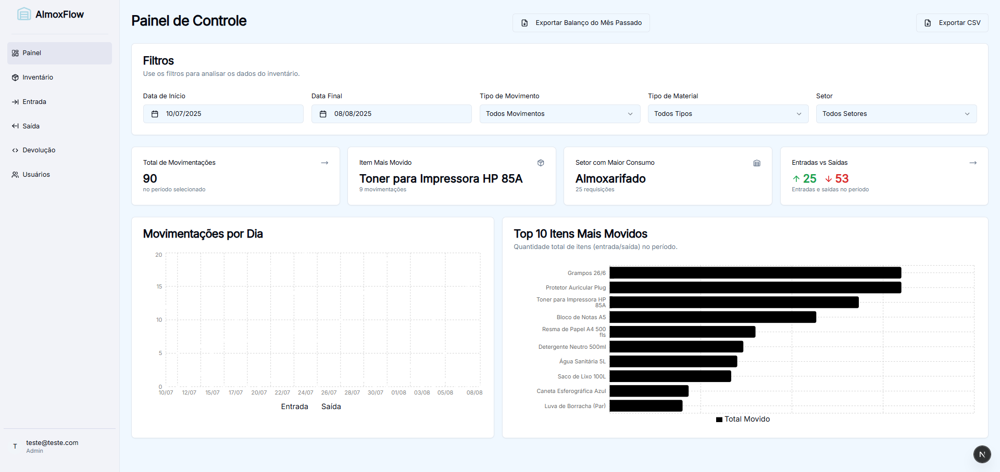
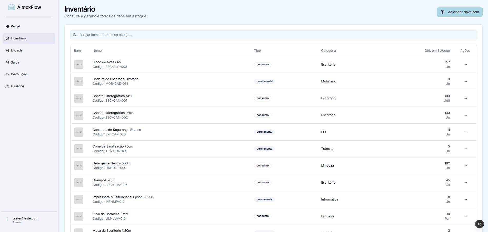
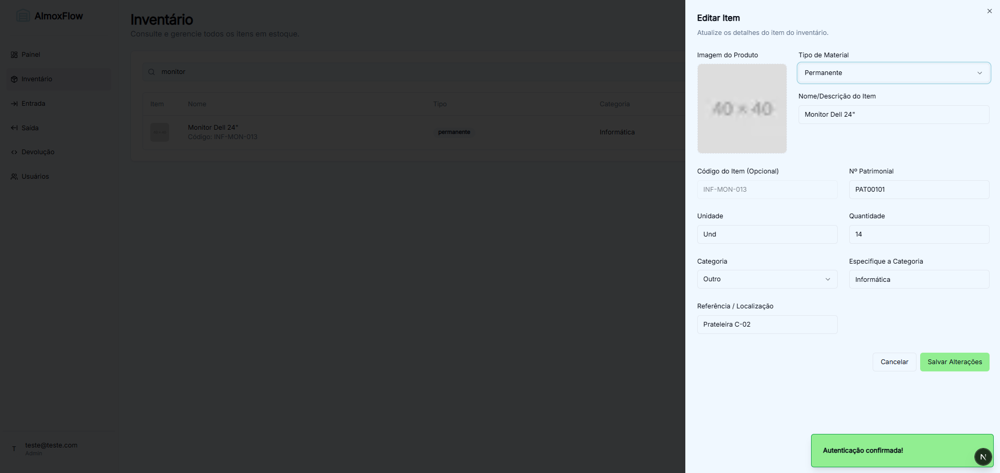
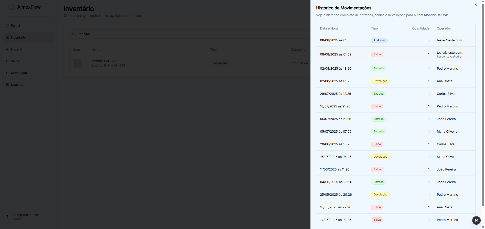
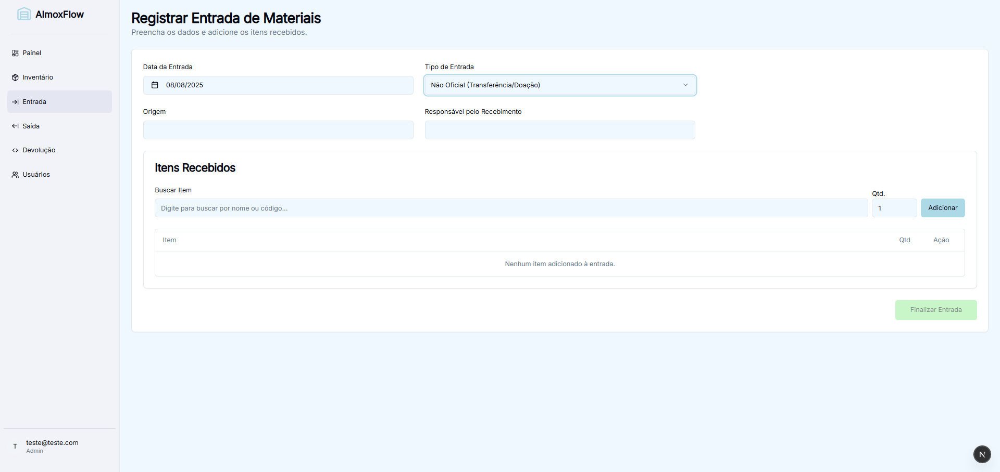
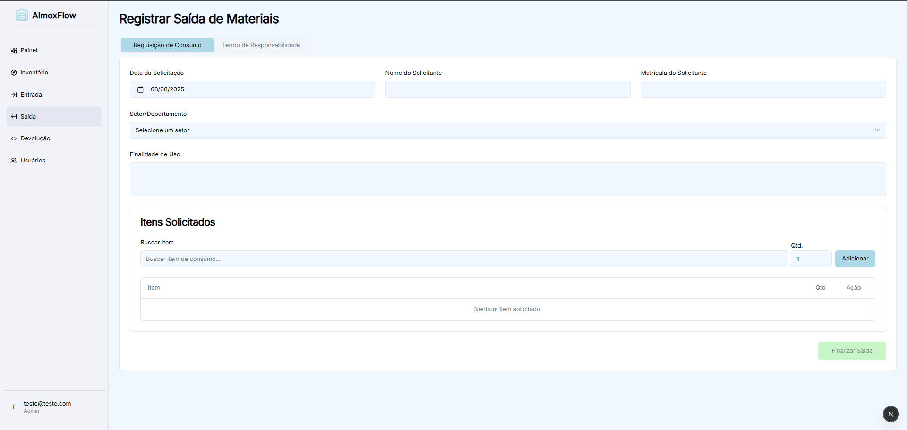
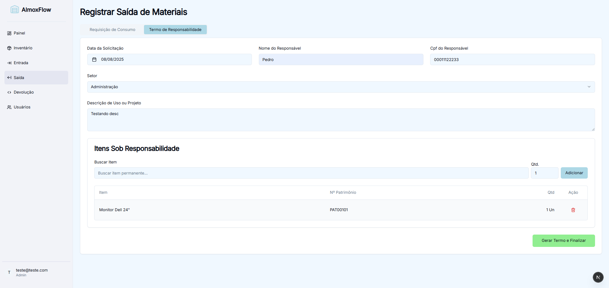
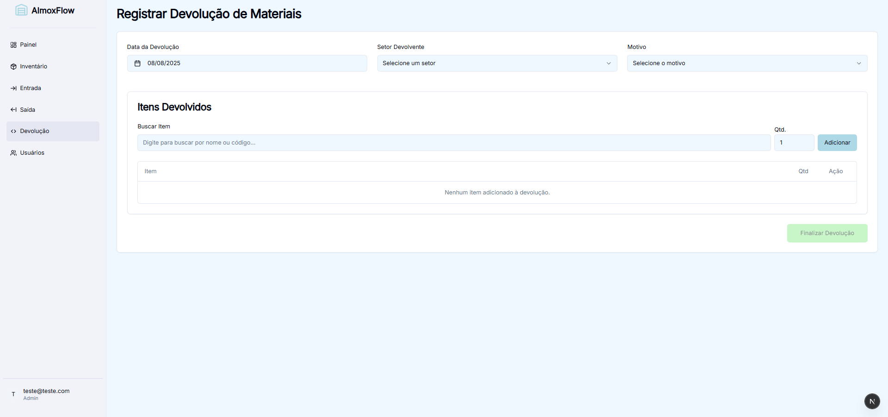
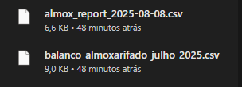

#  AlmoxFlow - Sistema de Gerenciamento de Estoque

AlmoxFlow é um sistema web completo para gerenciamento de inventário e almoxarifado, projetado para ser uma solução moderna e eficiente para o controle de entrada e saída de materiais. Construído com Next.js e Firebase, o projeto oferece uma interface de usuário reativa e um backend robusto e escalável.

Este projeto foi desenvolvido como um sistema de portfólio para demonstrar competências em desenvolvimento full-stack com tecnologias modernas.

## ✨ Funcionalidades

* **Autenticação de Usuários:** Sistema de login seguro com diferenciação de funções (Administrador e Operador).
* **Dashboard Analítico:** Painel de controle com visão geral das movimentações, gráficos de entradas/saídas, itens mais movimentados e consumo por setor, com filtros por período.
    
* **Gerenciamento de Inventário:**
    * Visualização, busca e filtragem de todos os itens em estoque.
        
    * Adição e edição de produtos, com upload de imagens.
        
    * Visualização do histórico completo de movimentações por item.
        
* **Registro de Movimentações:**
    * **Entrada:** Formulário para registrar a entrada de materiais, seja por compra (com nota fiscal) ou doação/transferência.
        
    * **Saída:** Módulo para registrar a saída de materiais, com formulários distintos para itens de consumo e itens permanentes (gerando Termo de Responsabilidade em PDF).
        
        
    * **Devolução:** Formulário para registrar a devolução de materiais ao almoxarifado.
        
* **Exportação de Dados:** Funcionalidade para exportar relatórios de movimentações em formato CSV.
    

## 🚀 Tecnologias Utilizadas

* **Frontend:**
    * [Next.js](https://nextjs.org/) (com App Router)
    * [React](https://react.dev/)
    * [TypeScript](https://www.typescriptlang.org/)
    * [Tailwind CSS](https://tailwindcss.com/)
    * [shadcn/ui](https://ui.shadcn.com/)
    * [Recharts](https://recharts.org/)
    * [jsPDF](https://github.com/parallax/jsPDF) & [jspdf-autotable](https://github.com/simonbengtsson/jsPDF-AutoTable)

* **Backend & Banco de Dados:**
    * [Firebase](https://firebase.google.com/): Plataforma completa para backend.
        * **Firestore:** Banco de dados NoSQL para armazenar produtos, movimentações e usuários.
        * **Authentication:** Para gerenciamento de login e funções de usuário.
        * **Storage:** Para armazenamento de imagens dos produtos.

## ⚙️ Configuração e Instalação

Siga os passos abaixo para executar o projeto localmente.

### Pré-requisitos

* Node.js (versão 20.x ou superior recomendada)
* NPM ou Yarn
* Uma conta no Firebase

### 1. Configuração do Projeto Firebase

1.  Acesse o [Console do Firebase](https://console.firebase.google.com/).
2.  Crie um novo projeto (ou use um existente). O nome do projeto neste repositório é "AlmoxFlow".
3.  Adicione um novo aplicativo da Web ao seu projeto.
4.  Copie as credenciais do Firebase (`firebaseConfig`) fornecidas a você.
5.  Ative os seguintes serviços no seu projeto Firebase:
    * **Authentication:** Ative o provedor "E-mail/Senha".
    * **Firestore Database:** Crie um novo banco de dados.
    * **Storage:** Ative o armazenamento de arquivos.

### 2. Instalação Local

1.  Clone o repositório:
    ```bash
    git clone https://github.com/seu-usuario/seu-repositorio.git
    cd seu-repositorio
    ```
2.  Instale as dependências:
    ```bash
    npm install
    ```
3.  Crie um arquivo de ambiente na raiz do projeto chamado `.env.local`:
    ```bash
    touch .env.local
    ```
4.  Adicione as suas credenciais do Firebase (que você copiou no passo 1.4) ao arquivo `.env.local`:
    ```
    NEXT_PUBLIC_FIREBASE_API_KEY=...
    NEXT_PUBLIC_FIREBASE_AUTH_DOMAIN=seu-projeto.firebaseapp.com
    NEXT_PUBLIC_FIREBASE_PROJECT_ID=seu-projeto
    NEXT_PUBLIC_FIREBASE_STORAGE_BUCKET=seu-projeto.appspot.com
    NEXT_PUBLIC_FIREBASE_MESSAGING_SENDER_ID=...
    NEXT_PUBLIC_FIREBASE_APP_ID=1:...
    ```

### 3. Configuração das Regras de Segurança do Firestore

Para que a aplicação funcione corretamente, você precisa aplicar as regras de segurança no seu banco de dados Firestore.

1.  Acesse seu banco de dados Firestore no console do Firebase.
2.  Vá para a guia **"Regras"** ("Rules").
3.  Copie e cole o conteúdo do arquivo `firestore.rules` do projeto no editor de regras e publique.

### 4. Executando a Aplicação

Com tudo configurado, inicie o servidor de desenvolvimento:

```bash
npm run dev
```

Abra [http://localhost:3000](http://localhost:3000) no seu navegador para ver a aplicação em funcionamento. Crie uma conta e comece a usar!

---

## ➕ Criando um usuário de desenvolvimento

O projeto possui uma rota de semente que cria automaticamente um usuário administrador de conveniência. Para utilizá‑la:

1. Defina a variável `SUPABASE_SERVICE_ROLE_KEY` no arquivo `.env.local` (obtida no painel do Supabase).
2. Inicie o servidor (`npm run dev`).
3. Envie um **POST** para `/api/seed-dev`, por exemplo:

```bash
curl -X POST http://localhost:3000/api/seed-dev
```

O endpoint criará um usuário com **email `dev@local`** e **senha `admin123`** e dará a ele a role `Admin`. Depois disso, use a tela de login para entrar com essas credenciais.